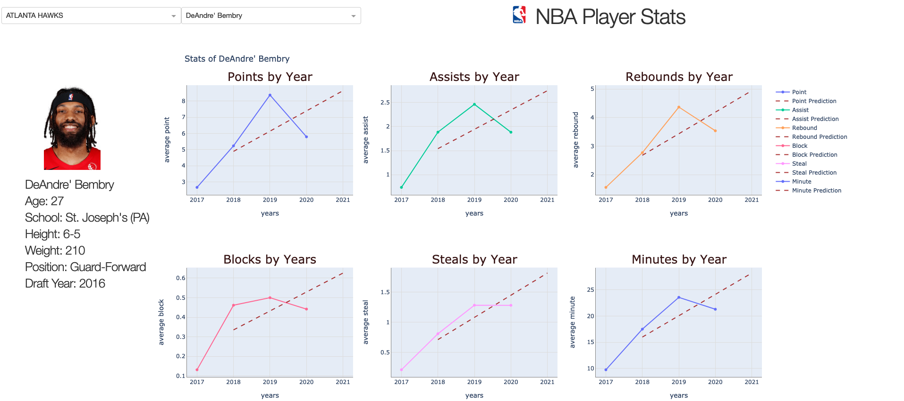

**Version 1.0.0**

This program shows the statistics of Nba players by years to its users. It also predicts players' statistics
for the next season by using statistics from previous years available to the user.
In this way, Nba fans will be able to easily access the statistics of the players they want, according to the years.

---

When the program is run, the user will encounter team and player drop-boxes.
Afterwards, the user will be able to see the point, assist, rebound, block, minutes, steal statistics of this player 
over the years on separate graphs by first selecting the player from behind the team.
Finally, the program provides users with predictive statistics for the next season using the players' statistics from 
the past years. 

---

The program uses two different API to get the player data which are nba_api and basketball_reference_web_scraper. Moreover, the dash libraries are used to build a dashboard on local server, the plotly used for interactive plots and the sklearn is used for the prediction. 

---

## References
pip install nba_api  
pip install basketball_reference_web_scraper  
pip install dash  
pip install dash_core_components  
pip install dash_html_components  
pip install plotly  
pip install sklearn  
pip install numpy  
pip install Unidecode  

